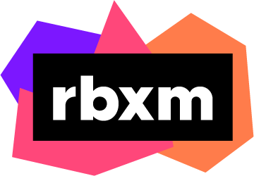

<h1 align="center">
	<br>
	
	<br>
	rbxm-suite
	<br>
</hi>

<h4 align="center">Designed for exploiting with a Rojo-based workflow</h4>

<p align="center">
	<a href="https://github.com/richie0866/rbxm-suite/actions/workflows/release.yml">
		
	</a>
	<a href="https://github.com/richie0866/rbxm-suite/releases/latest">
		
	</a>
</span>

## ❓ What's rbxm-suite?

`rbxm-suite` is the spiritual successor to Rostruct, designed for exploiting with a Rojo-based workflow.

With Rojo, you can store your modules, assets, and UI on the filesystem. Use Rojo to build your project to a rbxm file, and rbxm-suite can launch it in your exploit.

<br/>


## ⚡ Features

🔌 Asset downloader - Download model assets from GitHub Releases

🚀 Faster launch times - Outspeed Rostruct by bundling on execution

🧬 Use modules across projects

❌ Verbose errors for cyclic dependencies

<br/>


## 🌻 Motivation

[Rostruct](https://github.com/richie0866/Rostruct) is designed to mimic [Rojo](https://rojo.space) on execution, but it **isn't fully fleshed out** like Rojo is.

I designed rbxm-suite as a **straightforward** alternative. Instead of replacing Rojo, it aims to be **paired with Rojo** in your workflow. Build your project with Rojo, and leave the execution to rbxm-suite.

By moving the build process upstream, you can take advantage of a **true Rojo workflow**.

<br/>


## 🔌 Installation

You can load rbxm-suite through a GitHub Release:

``` lua
local rbxmSuite = loadstring(
	game:HttpGetAsync("https://github.com/richie0866/rbxm-suite/releases/download/v2.x.x/rbxm-suite.lua")
)()

-- Use rbxm-suite
```

Or, you can download `rbxm-suite.lua` from a release and modify it yourself:

``` lua
local rbxmSuite = (function()

	-- Minified code

)()

-- Use rbxm-suite
```

The unminified source is available in the repository.

<br/>


## ✨ Supported workflows

### ⚡ Rojo
* Build your Roblox projects with [Rojo](https://rojo.space).

### ⚡ TypeScript
* Write and compile TypeScript code with [roblox-ts](https://roblox-ts.com) (should be the `model` type!)

<br/>


## 📜 Usage

<details>
<summary>
🚀 <strong>Launch a project</strong>
</summary>

> ``` ts
> function rbxmSuite.launch(path: string, options: Options): Instance
> ```
> 
> Loads a rbxm(x) file into the game and loads all scripts.
>
> By default, it will run all enabled LocalScript objects.
```lua
local project = rbxmSuite.launch("path/to/Project.rbxm", {
	debug = false,
	runscripts = true,
	verbose = false,
	nocirculardeps = true,
})
```

<br/>

> ⚙️ **`debug`**
> 
> Enable debug mode. Defaults to `false`.
> 
> When `true`, error traceback is preserved and scripts are lazy-loaded with multiple `loadstring` calls.
> When `false`, every script is compiled at the same time with one `loadstring` call. Typically faster when `false`.
> 
> It should be left `false` in production, and set to `true` during development.

<br/>

> ⚙️ **`runscripts`**
> 
> Run every enabled LocalScript in your project on new threads. Defaults to `true`.

<br/>

> ⚙️ **`verbose`**
> 
> Enable verbose logging. Defaults to `false`.

<br/>

> ⚙️ **`nocirculardeps`**
> 
> Enable circular dependency prevention. Defaults to `true`.
> 
> In rare cases, some workflows need this set to `false`.

<br/>

</details>

---


<details>
<summary>
🔭 <strong>Require a specific module</strong>
</summary>

<br/>

> ``` ts
> function rbxmSuite.require(module: LocalScript | ModuleScript): any
> ```
> 
> Requires the module, and returns what the module returned. `module` must be a LocalScript or ModuleScript created by rbxmSuite.
> 
> Note that **any script** in the project can be required!
```lua
local myModule = rbxmSuite.launch("path/to/MyModule.rbxm")
local MyModule = rbxmSuite.require(myModule)
MyModule.doSomething()
```

</details>

---


<details>
<summary>
🐙 <strong>Download a project from GitHub</strong>
</summary>

<br/>

> ``` ts
> function rbxmSuite.download(repository: string, asset: string): string
> ```
> 
> Downloads a rbxm(x) asset from a GitHub Release, and returns a path to the asset.
> 
> The repository format is `user/repo@tag_name`.
```lua
local path = rbxmSuite.download("Roblox/roact@v1.4.0", "Roact.rbxm")
local model = rbxmSuite.launch(path)
local Roact = rbxmSuite.require(model)
Roact.createElement()
```

<br/>

> Set `tag_name` to `latest` to download and cache the latest version. Version checking and updating is performed in the background where possible.
```lua
local path = rbxmSuite.download("Roblox/roact@latest", "Roact.rbxm")
```

</details>
<br/>


## Notes

### 📌 In production, don't include unused modules.

When debug mode is `false`, modules that don't get required will still be bundled into one script.

If you have a lot of unused code, execution speed will be inconsistent between exploits. Be careful!

### 📌 GitHub is your friend.

Upload your project to GitHub, and create releases with an rbxm(x) file included as a binary file. A template project is coming soon!

You can distribute your project publicly by using rbxm-suite to download and run the latest release.
